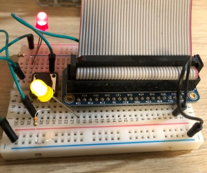

Getting Started
===============

Initial Setup and Configuration
-------------------------------

Assuming that you have latest Raspbian installed. These was written using ``stretch``.

#. Keyboard Layout::

       $ sudo dpkg-reconfigure keyboard-configuration
       $ cat /etc/default/keyboard
       
       # KEYBOARD CONFIGURATION FILE
       
       # Consult the keyboard(5) manual page.
       
       XKBMODEL="applealu_iso"
       XKBLAYOUT="fi"
       XKBVARIANT="mac"
       XKBOPTIONS="lv3:lalt_switch"
       
       BACKSPACE="guess"
       
       $ sudo reboot

#. WiFi Configuration::

       $ sudo iwlist wlan0 scan
       $ sudo su
       $ sudo wpa_passphrase "<SSID>" "<PASSWORD>" >> /etc/wpa_supplicant/wpa_supplicant.conf
       $ wpa_cli -i wlan0 reconfigure

#. Installing Rakudo Perl 6 from ``testing``
    
    Stable version of Raspbian has pretty outdated version of Rakudo Perl 6 so here's instructions for installing newer from testing::
    
        $ sudo apt-get install vim
        $ sudo vim /etc/apt/sources.d/testing.list 
        deb http://mirrordirector.raspbian.org/raspbian/ testing main contrib rpi

        $ sudo vim /etc/apt/preferences.d/testing
        Package: *
        Pin: release a=testing
        Pin-Priority: 100

        $ sudo apt-get update
        $ sudo apt-cache policy rakudo # Take the version number here e.g. 2017.06-1
        $ sudo apt-get install -t testing rakudo

#. Install ``zef`` Package Management Tool::

       $ sudo apt-get install git
       $ git clone https://github.com/ugexe/zef.git
       $ cd zef
       $ perl6 -Ilib bin/zef install .
       $ echo 'PATH=$PATH:/home/pi/.perl6/bin' >> ~/.bashrc
       $ source ~/.bashrc

#. Testing Rakudo Perl6 REPL
   
   Getting the history functionality and such to work we need to install e.g. ``Readline``::
   
       $ sudo apt-get install libreadline-dev
       $ zef install Readline
       $ perl6

GPIO Interface and First Touch to It
------------------------------------

|gpio-numbering|

Install Perl6 module from GitHub::

        $ git clone https://github.com/donaldh/Perl6-RPi-GpioDirect.git
        $ cd Perl6-RPi-GpioDirect/
        $ zef install .

Try with REPL or run through script file::

        $ perl6
        use RPi::GpioDirect;
        my $pi = RPi::GpioDirect.new;
        $pi.set-function(40, Out);
        loop {
            $pi.write(40, Off);
            sleep 0.5;
            $pi.write(40, On);
            sleep 0.5;
        }

Yellow LED + resistor connected from GPIO (board) 21 to GND. Photo of circuit:

|test-gpio-led|

.. |gpio-numbering| image:: gpio-numbering.png

Enable SSH server for Remote Access
-----------------------------------

Enable and start SSH server::

        $ sudo systemctl enable ssh
        $ sudo systemctl start ssh

If you get errors about policykit then you probably has policykit installed::

        $ sudo apt-get install policykit-1
        $ sudo systemctl start ssh

And remember to change password for ``pi``::

        $ passwd

Basic Git+GitHub Configuration
------------------------------

Basic user information::

        $ git config --global user.name "FirstName LastName"
        $ git config --global user.email "email@address"

SSH keys setup::

        $ ssh-keygen
        $ cat ~/.ssh/id_rsa.pub

And copy that public key to your GitHub account under settings/keys https://github.com/settings/keys

