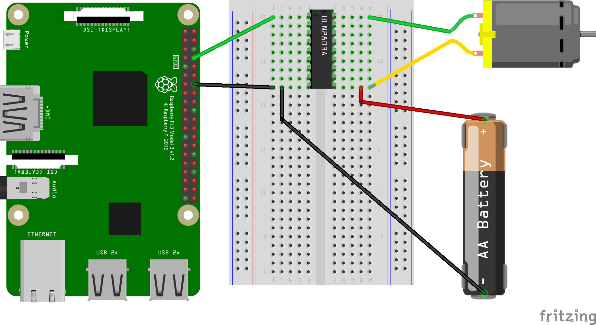

ULN2803
=======

Datasheet: ULN2803A.pdf :download:`pdf <datasheets/ULN2803A.pdf>`

DC motor
--------

Circuit:

|uln2803_dcmotor|

Code: ::

    #!/usr/bin/perl6
    
    use RPi::GpioDirect;
    
    my $pi = RPi::GpioDirect.new;
    $pi.set-function(8, Out);
    loop {
            $pi.write(8, Off);
            sleep 0.5;
            $pi.write(8, On);
            sleep 0.5;
    }

